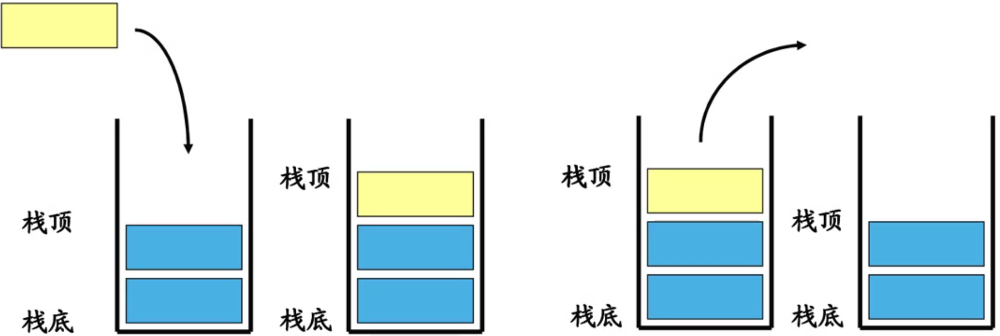
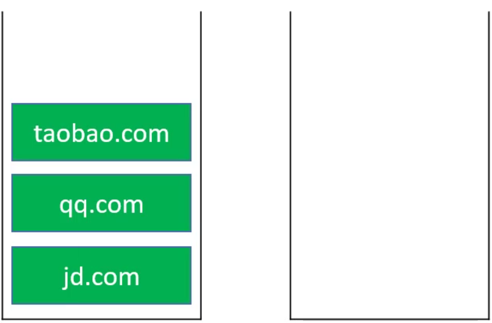

[栈（stack）](https://baike.baidu.com/item/%E6%A0%88/12808149?fr=aladdin)又名堆栈，它是一种运算受限的线性表。限定仅在表尾进行插入和删除操作的线性表。这一端被称为栈顶，相对地，把另一端称为栈底。向一个栈插入新元素又称作进栈、入栈或压栈，它是把新元素放到栈顶元素的上面，使之成为新的栈顶元素；从一个栈删除元素又称作出栈或退栈，它是把栈顶元素删除掉，使其相邻的元素成为新的栈顶元素。

<!-- more -->

# 栈
栈是一种特殊的线性表，智能在一端进行操作：  
往栈中添加元素的操作，一般叫做 push，入栈；  
从栈中移除元素的操作，一般叫做 pop，出栈（只能移除站定元素，也叫做：弹出栈顶元素）；  
后进先出的原则，Last In First Out ~ LIFO。  



## 接口设计
```
public class Stack<E> {
	/*
	 * 清空
	 */
	public void clear() {
		
	}
	/*
	 * 大小
	 */
	public int size() {
		return 0;
	}
	/*
	 * 判空
	 */
	public boolean isEmpty() {
		return false;
	}
	/*
	 * 入栈
	 */
	public void push(E element) {
		
	}
	/*
	 * 出栈
	 */
	public E pop() {
		return null;
	}
	/*
	 * 获取顶部元素
	 */
	public E top() {
		return null;
	}
}
```

因为动态数组和双向链表在添加删除随后一个元素的复杂度都是 O(1) 级别，所以这两种数据结构都可以用来实现栈。下面是采用动态数组实现的栈。


## 实现-继承
采用继承的方式实现栈，继承 ArrayList 实现：
```
import com.yq.list.ArrayList;

public class Stack<E> extends ArrayList<E>{
	/*
	 * 入栈
	 */
	public void push(E element) {
		add(element);
	}
	/*
	 * 出栈
	 */
	public E pop() {
		return remove(size-1);
	}
	/*
	 * 获取顶部元素
	 */
	public E top() {
		return get(size-1);
	}
}
```

`clear()`、`size()`和`isEmpty()` 父类已经实现了。

测试：
```
public static void main(String[] args) {
	Stack<Integer> stack = new Stack<>();
	stack.push(1);
	stack.push(2);
	stack.push(3);
	stack.push(4);
	
	while (!stack.isEmpty()) {
		System.out.println(stack.pop());
	}
}
```

打印结果：
```
4
3
2
1
```

继承可以实现栈的效果，但是却存在一个问题：stack 可以访问到 ArrayList 所有的开放接口，`stack.add()`、`stack.remove()` 等。解决方案👇。

## 实现-组合
采用组合的方式实现栈，实现：
```
public class Stack2<E> {
	ArrayList<E> list = new ArrayList<>();
	/*
	 * 清空
	 */
	public void clear() {
		list.clear();
	}
	/*
	 * 大小
	 */
	public int size() {
		return list.size();
	}
	/*
	 * 判空
	 */
	public boolean isEmpty() {
		return list.isEmpty();
	}
	/*
	 * 入栈
	 */
	public void push(E element) {
		list.add(element);
	}
	/*
	 * 出栈
	 */
	public E pop() {
		return list.remove(list.size()-1);
	}
	/*
	 * 获取顶部元素
	 */
	public E top() {
		return list.get(list.size()-1);
	}
}
```

测试：
```
static void testStack2() {
	Stack<Integer> stack = new Stack<>();
	stack.push(1);
	stack.push(2);
	stack.push(3);
	stack.push(4);
	
	while (!stack.isEmpty()) {
		System.out.println(stack.pop());
	}
}

public static void main(String[] args) {
	testStack2();
}
```

打印结果：
```
4
3
2
1
```

# 应用
游览器的前进和后退就是通过栈来实现的：

依次访问 jd.com、qq.com 和 baidu.com：

后退

后退

前进

访问 taobao.com


类似场景：软件的撤销、恢复功能。

# 练习
## 有效的括号
[20. 有效的括号](https://leetcode-cn.com/problems/valid-parentheses/)

1. 遇见左字符，将左字符入栈；
2. 遇见右字符：  
   如果展示空的，说明括号无效；  
   如果站不为空，将栈顶字符出出栈，与右字符匹配：  
   -> 如果左右字符不匹配 -> 括号无效；  
   -> 如果左右字符匹配 -> 继续扫描下一个字符；
3. 所有字符扫描完毕后：  
   栈为空 -> 括号有效；  
   栈不为空 -> 括号无效；
```
public boolean isValid(String s) {
	Stack<Character> stack = new Stack<>();
	
	for (int i = 0; i < s.length(); i++) {
		char c = s.charAt(i);
		if (c == '(' || c == '[' || c == '{') {
			stack.push(c);
		} else {
			if (stack.isEmpty()) return false;
			
			char left = stack.pop();
			if (left == '(' && c != ')') return false;
			if (left == '[' && c != ']') return false;
			if (left == '{' && c != '}') return false;
		}	
	}
	
	return stack.isEmpty();
}
```

## 括号的分数
[856. 括号的分数](https://leetcode-cn.com/problems/score-of-parentheses/)  
[括号的分数 - 方法二：栈](https://leetcode-cn.com/problems/score-of-parentheses/solution/gua-hao-de-fen-shu-fang-fa-er-zhan-by-yang-h6/)
```
/*
 * ()、(()(、()( 对于只有一层括号的情况，top == 0：
 * 1. 取出 top = pop();
 * 2. 修改 top = 1，并 push(top);
 * 3. 判断前一项是否可加
 *  
 * 示例：
 * ( : [0] ~> () : [1] 
 * (()( : [0, 1, 0] ~> (()() : [0, 2]
 * ()(：[1, 0] ~> ()()：[2]
 */
 /* 
 * (())、(()()) 对于外层有括号的情况，top != 0：
 * 1. 取出 top = pop();
 * 2. 修改 top *=2，并 push(top);
 * 3. 判断前一项是否可加；
 * 
 * 示例：
 * (() : [0, 1] ~> (()) : [2]
 * (()() : [0, 1, 1] ~> (()()) : [4]
 * (()(( : [0, 1, 0, 0] ~> (()(() : [0, 1, 1]
 */
static int scoreOfParentheses6(String S) {
	Stack<Integer> stack = new Stack<>();
	stack.push(0);
	for (char c : S.toCharArray()) {
		if (c == '(') {
			stack.push(0);
		} else {
			int top = stack.pop();
			int left = stack.pop();
			stack.push(left + Math.max(2 * top, 1));
		}
	}
	return stack.pop();
}
```

## 逆波兰表达式求值
[150. 逆波兰表达式求值](https://leetcode-cn.com/problems/evaluate-reverse-polish-notation/)

```
static int evalRPN(String[] tokens) {
	Stack<Integer> stack = new Stack<>(); 
	for (String s : tokens) {
		if (s == "+") {
			stack.push(stack.pop() + stack.pop());
		} else if (s == "-") {
			stack.push(-(stack.pop() - stack.pop()));
		} else if (s == "*") {
			stack.push(stack.pop() * stack.pop());
		} else if (s == "/") {
			Integer s1 = stack.pop();
			stack.push(stack.pop() / s1);
		} else {
			stack.push(Integer.valueOf(s));
		}
	}
	return stack.pop();
}
```

## 基本计算器
[224. 基本计算器](https://leetcode-cn.com/problems/basic-calculator/)
```
static int calculate(String s) {
	Stack<Integer> stack = new Stack<>();
	int res = 0;
	int operand = 0; //位数
	int sign = 1; //+：1，-：-1
	
	for (char c : s.toCharArray()) {
		if (c == ' ')
			continue;
		
		if (c >= '0' && c <= '9') {
			operand = operand*10 + (c - '0');
		} else if (c == '+' || c == '-') {
			res += operand*sign;
			operand = 0; // 重置位数
			sign = c == '+' ? 1 : -1; // 重置符号
			
		} else if (c == '(') {
			stack.push(res);
			stack.push(sign);
			res = 0;
			sign = 1;
		} else { // c == ')'
			res += operand*sign;
			operand = 0;
			
			int a = stack.pop(); //上一次的 sign
			int b = stack.pop(); //上一次的 sum
			
			res += b*a;
		}
	}
	return res + sign * operand;
}
```

