[链表](https://baike.baidu.com/item/%E9%93%BE%E8%A1%A8/9794473?fr=aladdin)是一种物理存储单元上非连续、非顺序的存储结构，数据元素的逻辑顺序是通过链表中的指针链接次序实现的。

<!-- more -->

# 单向链表
动态数组在扩容时，如果新扩出来的空间没有使用到，就造成了内存空间的大量浪费。而链表则是用到多少就申请多少内存空间。

线性表的链式存储表示的特点是用一组任意的存储单元存储线性表的数据元素。这组存储单元可以是连续的，也可以是不连续的。

链表由一系列结点（链表中每一个元素称为结点）组成，结点可以在运行时动态生成。每个结点包括两个部分：一个是存储数据元素的数据域，另一个是存储下一个结点地址的指针域。


## 自定义链表
### 链表的设计
定义 size 记录链表的大小，定义 firt 指向第一个节点（头结点）。每个节点里定义 element 存储数据，定义 next 指向下一个节点（存储下一个结点地址）。


### 接口设计

创建一个接口类 List，用来定义 ArrayList 和 LinkedList 的公共接口（右键 -> new -> Interface）：
```
public interface List<E> {
    /**
     * 错误码
     */
    public static final int ELEMENT_NOT_FOUND = -1;
    /**
     * 清除所有元素
     */
    public void clear();
    /**
     * 元素的数量
     * @return
     */
    public int size();
    /**
     * 是否为空
     * @return
     */
    public boolean isEmpty();
    /**
     * 是否包含某个元素
     * @param element
     * @return
     */
    public boolean contains(E element);
    /**
     * 添加元素到尾部
     * @param element
     */
    public void add(E element); 
    /**
     * 获取index位置的元素
     * @param index
     * @return
     */
    public E get(int index);
    /**
     * 设置index位置的元素
     * @param index
     * @param element
     * @return 原来的元素ֵ
     */
    public E set(int index, E element);
    /**
     * 在index位置插入一个元素
     * @param index
     * @param element
     */
    public void add(int index, E element);
    /**
     * 删除index位置的元素
     * @param index
     * @return
     */
    public E remove(int index);
    /**
     * 查看元素的索引
     * @param element
     * @return
     */
    public int indexOf(E element);
}
```

创建一个抽象类 AbstractList，实现 ArrayList 和 LinkedList 有相同实现的方法：
```
// implements 实现接口
// abstract 抽象类：1、可以选择实现接口；2、抽象类无法被创建（new AbstractList<>()）
public abstract class AbstractList<E> implements List<E>{
    
    protected int size; // protected 子类可以访问
    
    @Override
    public int size() {
        return size;
    }

    @Override
    public boolean isEmpty() {
        return size == 0;
    }

    @Override
    public boolean contains(E element) {
        return indexOf(element) != ELEMENT_NOT_FOUND;
    }

    @Override
    public void add(E element) {
        add(size, element);
    }
    
    protected void outOfBounds(int index) {
        throw new IndexOutOfBoundsException("Index:" + index + ", Size" + size);
    }
    
    protected void rangeCheck(int index) {
        if (index < 0 || index >= size) {
            outOfBounds(index);
        }
    }
    
    protected void rangeCheckForAdd(int index) {
        if (index < 0 || index > size) {
            outOfBounds(index);
        }
    }
}
```

让 ArrayList 和 LinkedList 继承自 AbstractList：
```
// 动态数组
public class ArrayList<E> extends AbstractList<E> { 
    // 实现剩余方法
}

// 链表
public class LinkedList<E> extends AbstractList<E> {
    // 实现剩余方法
}
```

ps：  
实现 List 接口的快捷方式：


### clear
```
public void clear() {
    size = 0;
    first = null;
}
```
图解：


### get/set
定义 `node(int index)` 方法，查找指定 index 处的 node 并返回：
```
public E get(int index) {
    return node(index).element;
}

public E set(int index, E element) {
    Node<E> node = node(index);
    E old = node.element;
    node.element = element;
    return old;
}

private Node<E> node(int index) {
    rangeCheck(index);
    
    Node<E> node = first;
    for (int i = 0; i < index; i++) {
        node = node.next;
    }
    return node;
}
```

### add
添加新的 newNode：


#### index == 1
要添加一个 node 到 index == 1 的位置，只需要找到 index - 1 处的 prev，那么 index == 1 处就是 prev.next。让新添加的 newNode 的 next 指向 prev.next，再让 prev 的 next 指针指向 newNode：


#### index == size
要添加一个 node 到 index == size 的位置，只需要找到 index - 1 处的 prev，那么 index == size 处就是 prev.next（null）。让新添加的 newNode 的 next 指向 prev.next，再让 prev 的 next 指针指向 newNode：


#### index == 0
要添加一个 node 到 index == 0 的位置，只需要让新添加的 newNode 的 next 指向 first，再让 first 指向 newNode：


#### 代码实现
```
public void add(int index, E element) {
    rangeCheckForAdd(index);
    
    if (index == 0) {
        first = new Node<>(element, first);
    } else {
        Node<E> prev = node(index - 1);
        prev.next = new Node<>(element, prev.next); 
    }
    size++;
}
```

### remove
1. 要删除 index == 1 处的 node，只需要找到 index - 1 出的 prev，让 `prev.next = prev.next.next`。
2. 要删除 index == 0 处的 node，只需要让 `first = first.next`。
```
public E remove(int index) {
    rangeCheck(index);
    
    Node<E> node = first;
    if (index == 0) {
        first = first.next;
    } else {
        Node<E> prev = node(index - 1);
        node = prev.next;
        prev.next = node.next;  
    }
    size--;
    return node.element;
}
```
图解：


### indexOf
```
public int indexOf(E element) {
    if (element == null) {
        Node<E> node = first;
        for (int i = 0; i < size; i++) {
            if (node.element == null) return i;
            
            node = node.next;
        }
    } else {
        Node<E> node = first;
        for (int i = 0; i < size; i++) {
            if (node.element.equals(element)) return i;
            
            node = node.next;
        }   
    }
    return ELEMENT_NOT_FOUND;
}
```

ps：[VisuAlgo](https://visualgo.net/zh) 以动画的方式展示了数据结构基本操作的原理，还有代码实现。

## 练习
链表的题目会用到一个 ListNode 节点类，所以先创建一个节点类：
```
public class ListNode {
    int val;
    ListNode next;
    ListNode(int x) {
        val = x;
    }
}
```

### 删除链表中的节点
基本操作：  
1. 以题目的类型和题目名称分别创建“链表”包和“_237_删除链表中的节点”文件；
2. 保存改题目的连接：[237. 删除链表中的节点](https://leetcode-cn.com/problems/delete-node-in-a-linked-list/)，方便以后查看；
3. 拷贝网页中的条件及题目；


分析：删除指定节点 node，可以将 node 下一个节点的内容覆盖掉 node 的内容，让后将 node 的下一个节点删除掉 `node.next = node.next.next`：
```
public void deleteNode(ListNode node) {
    node.val = node.next.val;
    node.next = node.next.next;
}
```
图解：
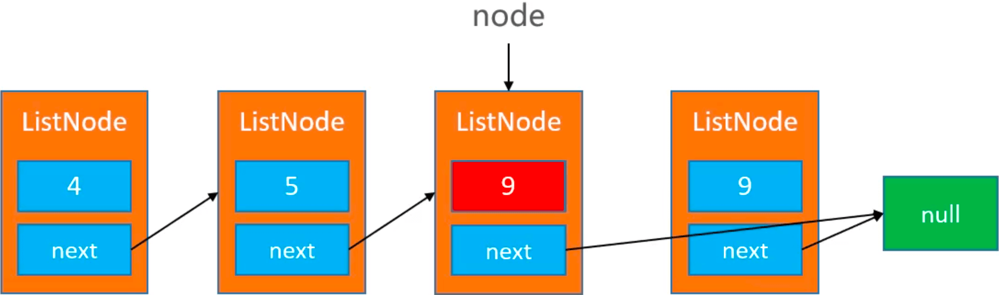

### 反转一个链表
[206. 反转链表](https://leetcode-cn.com/problems/reverse-linked-list/)
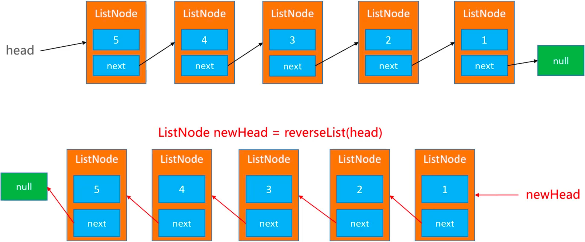
#### 递归
[5, 4, 3, 2, 1] 传入4，reverseList(4) -> [1, 2, 3, 4]：
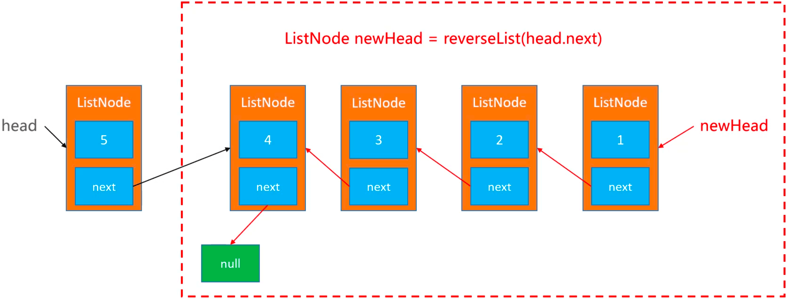
代码实现：
```
//[5, 4, 3, 2, 1], head：5
public ListNode reverseList(ListNode head) {
    // 添加边界，避免死循环
    // head == null 表示没有元素
    // head.next == null 表示只有一个元素
    if (head == null || head.next == null) return head;
    
    // 1->2, 2->3, 3->4, 4->5
    ListNode newHead = reverseList(head.next);
    head.next.next = head;
    head.next = null;
    return newHead;
}
```

#### 迭代
newHead, head -> [5, 4, 3, 2, 1]  
newHead -> [5], head -> [4, 3, 2, 1]  
newHead -> [5, 4], head -> [3, 2, 1]  
...
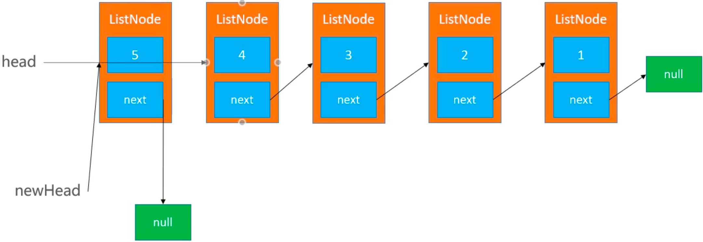
代码实现：
```
public ListNode reverseList2(ListNode head) {
    if (head == null || head.next == null) return head;
    
    ListNode newHead = null;
    while (head != null) {
        ListNode tmp = head.next;
        head.next = newHead;
        newHead = head;
        head = tmp;
    }
    return newHead;
}
```

### 判断一个链表是否有环
[141. 环形链表](https://leetcode-cn.com/problems/linked-list-cycle/)  
快慢指针：slow 移动1个元素/次，fast 移动2个元素/次，当 slow 和 fast 相遇的时候，说明链表有环。
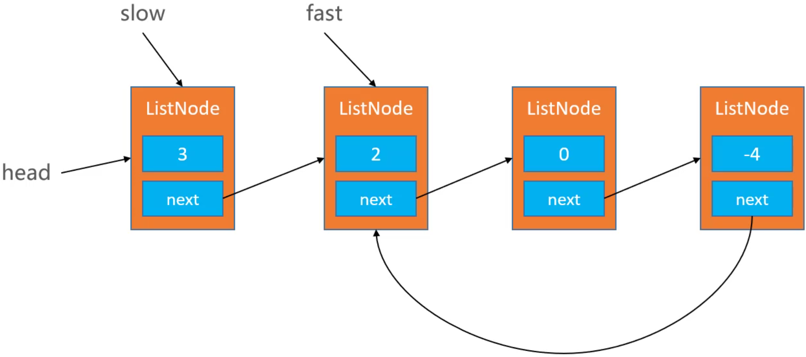
代码实现：
```
public boolean hasCycle(ListNode head) {
    if (head == null || head.next == null) return false;
    
    ListNode slow = head;
    ListNode fast = head.next;
    while (fast != null && fast.next != null) {
        slow = slow.next;
        fast = fast.next.next;
        if (slow == fast) return true;
    }
    return false;
}
```

### 移除链表元素
[203. 移除链表元素](https://leetcode-cn.com/problems/remove-linked-list-elements/)
```
public ListNode removeElements(ListNode head, int val) {
    if (head == null) return head;
    
    // 遍历链表
    ListNode node = head;
    while (node.next != null) {
        if (node.next.val == val) {
            node.next = node.next.next;
        } else {
            node = node.next;
        }
    }

    // 判断头结点
    if (head.val == val) {
        if (head.next == null) {
            return null;
        } else {
            head = head.next;
        }
    }
    
    return head;
}
```

### 删除排序链表中的重复元素
[83. 删除排序链表中的重复元素](https://leetcode-cn.com/problems/remove-duplicates-from-sorted-list/submissions/)
```
public ListNode deleteDuplicates(ListNode head) {
    if (head == null || head.next == null) return head;
    // 遍历链表
    ListNode node = head;
    while (node != null) {
        
        // 从 node 开始遍历链表
        ListNode targetNode = node;
        while (targetNode.next != null) {
            if (targetNode.next.val == node.val) {
                targetNode.next = targetNode.next.next;
            } else {
                targetNode = targetNode.next;   
            }
        }
        
        node = node.next;
    }
    
    return head;
}
```

### 链表的中间节点
[876. 链表的中间结点](https://leetcode-cn.com/problems/middle-of-the-linked-list/)
```
public ListNode middleNode(ListNode head) {
    int count = 0; // 标记链表长度
    // 遍历链表
    ListNode node = head;
    while (node != null) {
        count++;
        node = node.next;
    }
    
    count = count/2;
    // 遍历链表
    while (node != null) {
        if (count > 0) {
            count--;
        } else {
            break; // 此时 node 为中间节点
        }
        node = node.next;
    }
    
    return node;
}
```

## 虚拟结点
在链表的最前面增加一个虚拟头结点（不存储数据），可以统一所有节点的处理逻辑，让代码更加精简：
```
// 添加构造方法，添加虚拟头结点
public LinkedList2() {
    first = new Node<>(null, null);
}

// 修改add
public void add(int index, E element) {
    rangeCheckForAdd(index);
    Node<E> prev = index == 0 ? first : node(index - 1);
    prev.next = new Node<>(element, prev.next);
    size++;
}

// 修改remove
public E remove(int index) {
    rangeCheck(index);
    Node<E> prev = index == 0 ? first : node(index - 1);
    Node<E> node = prev.next;
    prev.next = node.next;
    size--;
    return node.element;
}

// 修改node
private Node<E> node(int index) {
    rangeCheck(index);
    
    Node<E> node = first.next;
    for (int i = 0; i < index; i++) {
        node = node.next;
    }
    return node;
}
```

## 复杂度分析
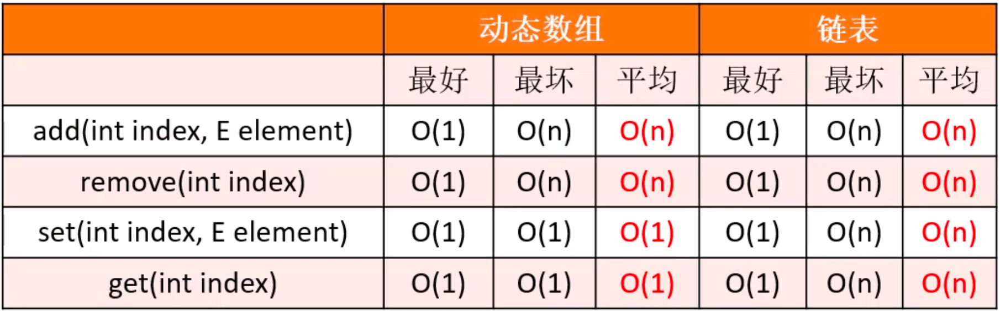

### 动态数组
#### add(E element)
最好情况复杂度：在 `index == size` 处添加元素，不需要移动任何元素，复杂度 O(1)；  
最坏情况复杂度：在 `index == size` 处添加元素时容量不够需要扩容，所有元素都要移动到新扩容的数组里，复杂度 O(n)；  
平均情况复杂度：所有情况的移动次数相加再除以元素个数：`(1 + 1 + 1 + ... + 1 + n) / n` -> O(2n/2)，复杂度 O(1)；  
均摊复杂度：O(1)。

均摊复杂度：假设最大容量是4，扩容相当于每次 add 的操作次数是 2，也就是O(1)复杂度：
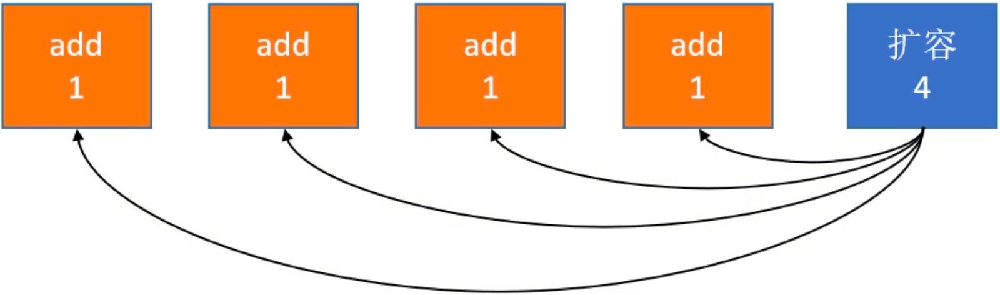
在经过连续的多次复杂度比较低的情况后，出现个别复杂度比较高的情况时，适合均摊复杂度。

#### add(int index, E element)
最好情况复杂度：在 `index == size` 处添加元素，不需要移动任何元素，复杂度 O(1)；  
最坏情况复杂度：在 `index == 0` 处添加元素，所有元素都要向后移动一位，复杂度 O(n)；  
平均情况复杂度：所有情况的移动次数相加再除以元素个数：`(1 + 2 + 3 + ... + n) / n` -> O(n/2)，复杂度 O(n)。
#### remove
最好情况复杂度：删除 `index == size - 1` 处的元素，不需要移动任何元素，复杂度 O(1)； 
最坏情况复杂度：删除 `index == 0` 处的元素，所有元素都要向前移动一位，复杂度 O(n)；  
平均情况复杂度：所有情况的移动次数相加再除以元素个数：`(1 + 2 + 3 + ... + n) / n` -> O(n/2)，复杂度 O(n)。
#### set & get
数组的随机访问速度非常快，`elements[n]` 的效率与 n 是多少无关。
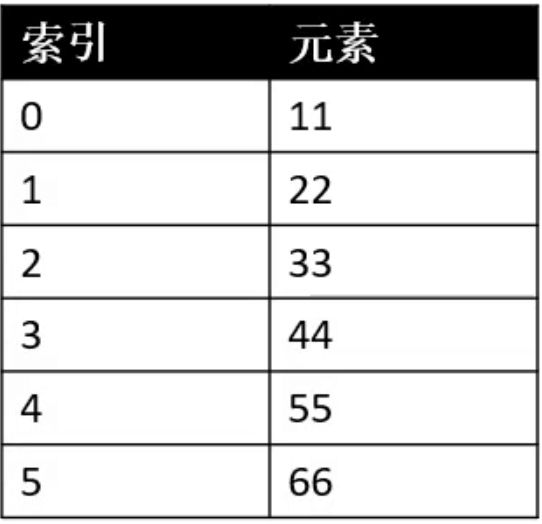

### 单向链表
#### add
最好情况复杂度：在 `index == 0` 处添加元素，只需要创建一个新的节点，并让 first 指向该节点，复杂度 O(1)；  
最坏情况复杂度：在 `index == size - 1` 处添加元素，需要遍历所有节点，才能找到最后一个节点，并让最后一个节点指向新创建的节点，复杂度 O(n)；  
平均情况复杂度：所有情况的移动次数相加再除以元素个数：`(1 + 2 + 3 + ... + n) / n` -> O(n/2)，复杂度 O(n)。
#### remove
最好情况复杂度：删除 `index == 0` 处的元素，只需要找到 first，并让 first 指向该节点的下一个节点，复杂度 O(1)；  
最坏情况复杂度：删除 `index == size - 1` 处的元素，需要遍历所有节点，才能找到倒数第二个节点，并让倒数第二个节点指向 null，复杂度 O(n)；  
平均情况复杂度：所有情况的移动次数相加再除以元素个数：`(1 + 2 + 3 + ... + n) / n` -> O(n/2)，复杂度 O(n)。
#### set & get
最好情况复杂度：查找 `index == 0` 处的元素，不需要遍历，直接通过 `first.next` 就可以找到第一个节点，复杂度 O(1)；  
最坏情况复杂度：查找 `index == size - 1` 处的元素，需要遍历所有节点，才能找到最后一个节点，复杂度 O(n)；  
平均情况复杂度：所有情况的移动次数相加再除以元素个数：`(1 + 2 + 3 + ... + n) / n` -> O(n/2)，复杂度 O(n)。

# 双向链表
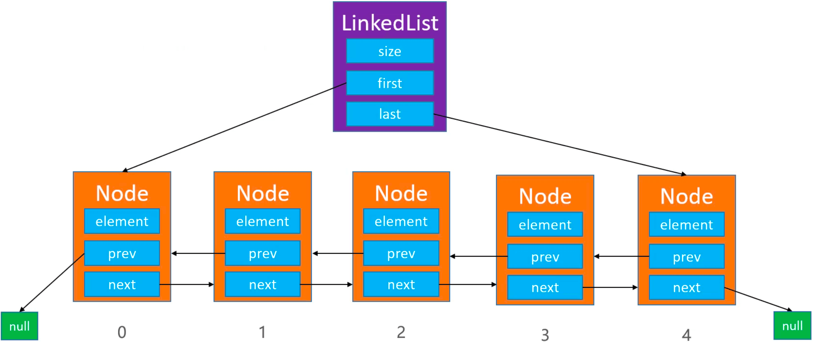
双向链表的代码实现，是在单向链表的代码基础上进行以下修改👇。

## set&get
只需要修改 `node()` 方法即可：
```
private Node<E> node(int index) {
    rangeCheck(index);
    
    if (index < (size >> 1)) {
        Node<E> node = first;
        for (int i = 0; i < index; i++) {
            node = node.next;
        }
        return node;
    } else {
        Node<E> node = last;
        for (int i = size - 1; i > index; i--) {
            node = node.prev;
        }
        return node;
    }
}
```

## add
```
public void add(int index, E element) {
    rangeCheckForAdd(index);
    
    if (index == size) {
        Node<E> oldLast = last;
        last = new Node<>(oldLast, element, null);
        if (oldLast == null) { // 这是链表添加的第一个元素
            first = last;
        } else {
            oldLast.next = last;
        }
    } else {
        Node<E> next = node(index);
        Node<E> prev = next.prev;
        Node<E> node = new Node<>(prev, element, next);
        next.prev = node;
        
        if (prev == null) { // index == 0
            first = node;
        } else {
            prev.next = node;
        }
    }
    size++;
}
```
在 `0 < index < size` 处添加元素：
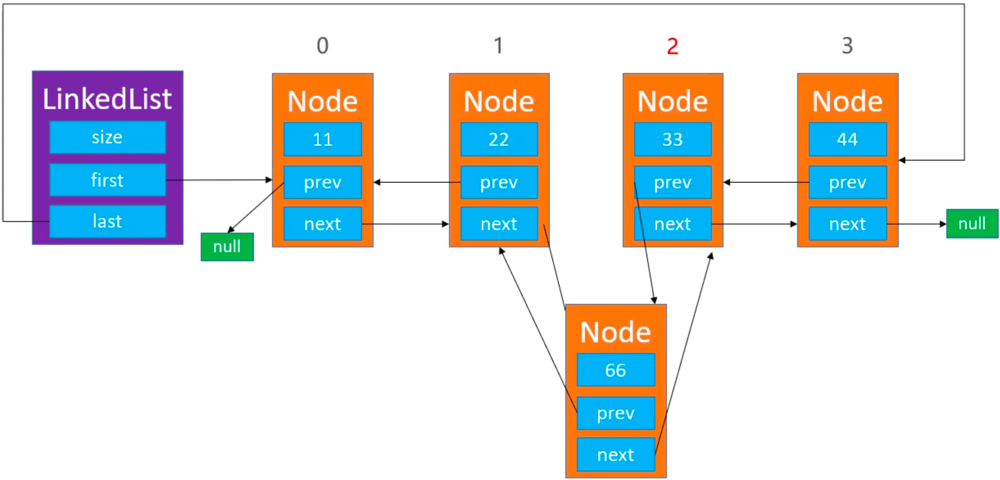
在 `index == 0` 处添加元素：
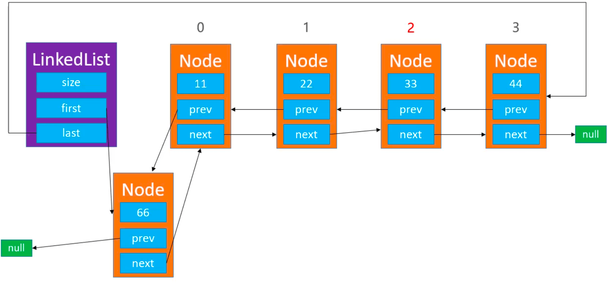
在 `index == size` 处添加元素，分为首次添加元素和非首次添加元素：  
首次添加元素：
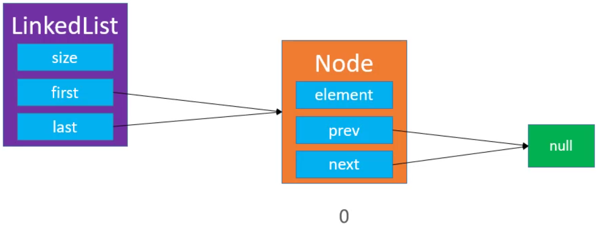
非首次添加元素：
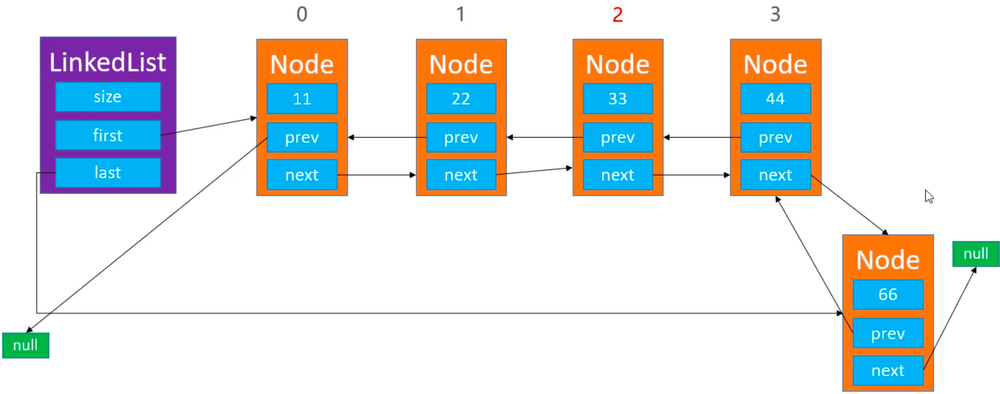

## remove
```
public E remove(int index) {
    rangeCheck(index);
    
    Node<E> node = node(index);
    Node<E> prev = node.prev;
    Node<E> next = node.next;
    
    if (prev == null) { // index == 0
        first = next;
    } else {
        prev.next = next;
    }
    
    if (next == null) { // index == size - 1
        last = prev;
    } else {
        next.prev = prev;
    }
    
    size--;
    return node.element;
}
```
删除 `0 < index < size` 处的元素：
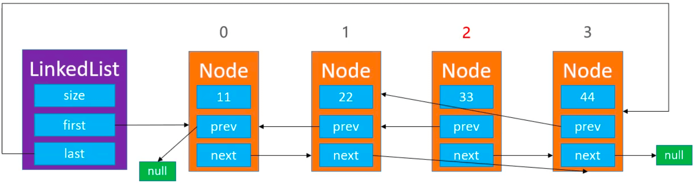
删除 `index == 0` 处的元素：
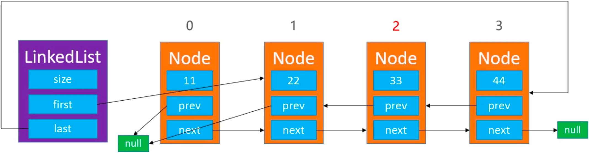

## 测试
修改 LinkedList 的 `toString()` 方法：
```
public String toString() {
    StringBuilder string = new StringBuilder();
    string.append("size=").append(size).append(", [");
    Node<E> node = first;
    for (int i = 0; i < size; i++) {
        if (i != 0) {
            string.append(", ");
        }
        string.append(node);
        
        node = node.next;
    }
    string.append("]");
    return string.toString();
}
```

在 `class Node<E>` 里重写 `toString()` 方法：
```
public String toString() {
    StringBuilder sb = new StringBuilder();
    
    if (prev != null) {
        sb.append(prev.element);
    } else {
        sb.append("null");
    }
    
    sb.append("_").append(element).append("_");

    if (next != null) {
        sb.append(next.element);
    } else {
        sb.append("null");
    }
    
    return sb.toString();
}
```

在 Main.java 里添加测试代码：
```
public class Main {

    public static void main(String[] args) {
        List<Integer> list = new LinkedList<>();
        list.add(12);
        list.add(0, 11);
        list.add(13);
        list.add(14);
        list.add(15);
        list.add(list.size(), 16);
        
        list.remove(1);
        list.remove(2);
        
        System.out.println(list);
    }
}
```

打印结果：
```
size=4, [null_11_13, 11_13_15, 13_15_16, 15_16_null]
```

## 双向链表 vs 单向链表
单向链表：`1 + 2 + 3 + ... + n = (1 + n) * n/2 = n/2 + (n^2)/2`，除以 n 平均一下是 `1/2 + n/2`；  
双向链表：`(1 + 2 + 3 + ... + n/2) * 2 = ((1 + n/2) * n/2)/2 * 2 = n/2 + (n^2)/4`，除以 n 平均一下是 `1/2 + n/4`。

## 双向链表 vs 动态数组
动态数组：开辟、销毁内存空间的次数相对较少，但可能造成内存空间浪费（可以通过缩容解决）；   
双向链表：开辟、销毁内存空间的次数相对较多，但不会造成内存空间的浪费。

# 单向循环链表
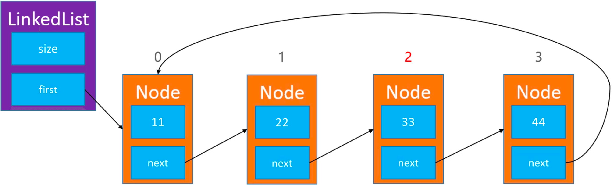
单向循环链表中只有一个元素的情况：
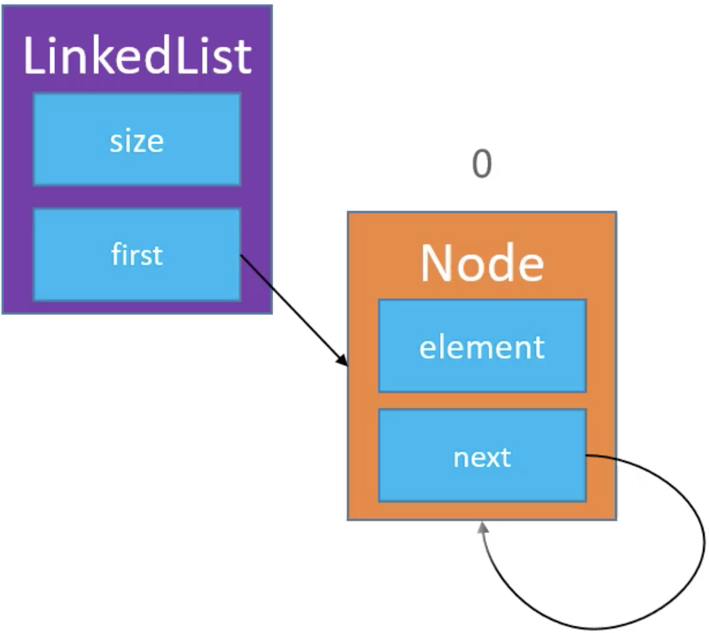
在单向链表的代码基础上进行修改，需要修改的有 `add()` 和 `remove()` 方法。
## add
单向循环链表的添加，主要是在 `index == 0` 处的逻辑需要修改：
1. 让最后面节点的 next 指向新添加的节点；
2. 让 first 指向新添加的节点；
```
public void add(int index, E element) {
    rangeCheckForAdd(index);
    
    if (index == 0) {
        Node<E> newFirst = new Node<>(element, first);
        // 拿到最后一个节点
        Node<E> last = (size == 0) ? newFirst : node(size - 1);
        last.next = newFirst;
        first = newFirst;
    } else {
        Node<E> prev = node(index - 1);
        prev.next = new Node<>(element, prev.next); 
    }
    size++;
}
```

## remove
单向循环链表的删除，主要是在 `index == 0` 处的逻辑需要修改：
1. 如果链表中只有一个节点，直接让 `first = null`；
2. 让 first 指向 `index == 1` 处的元素；
3. 让 last 指向 `index == 1` 处的元素（`last.next = first`）；
```
public E remove(int index) {
    rangeCheck(index);
    
    Node<E> node = first;
    if (index == 0) {
        if (size == 1) {
            first = null;
        } else {
            Node<E> last = node(size - 1); // 必须在 first = first.next 前获取
            first = first.next;
            last.next = first;
        }
    } else {
        Node<E> prev = node(index - 1);
        node = prev.next;
        prev.next = node.next;  
    }
    size--;
    return node.element;
}
```

# 双向循环链表
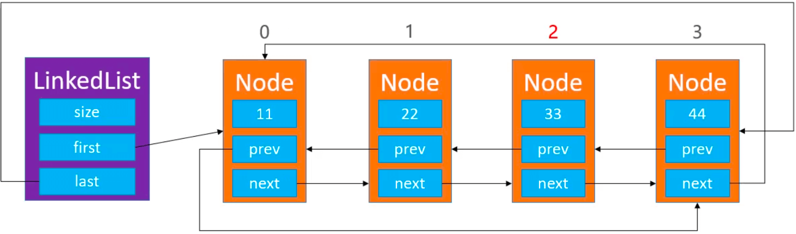
在双向链表的代码基础上进行修改，需要修改的有 `add()` 和 `remove()` 方法。
## add
```
public void add(int index, E element) {
    rangeCheckForAdd(index);
    
    if (index == size) { // index == size
        Node<E> oldLast = last;
        last = new Node<>(oldLast, element, first);
        if (oldLast == null) { // 这是链表添加的第一个元素
            first = last;
            first.prev = first;
            first.next = first;
        } else {
            oldLast.next = last;
            first.prev = last;
        }
    } else {
        Node<E> next = node(index);
        Node<E> prev = next.prev;
        Node<E> node = new Node<>(prev, element, next);
        next.prev = node;
        prev.next = node; // 双向链表中，prev 一定不为 null
        
        if (next == first) { // index == 0
            first = node;
        }
    }
    size++;
}
```
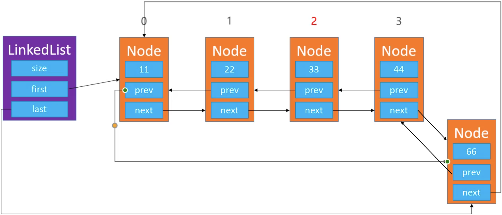
双向循环链表中只有一个节点的情况：
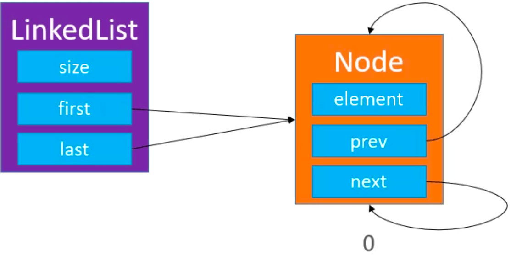

## remove
```
public E remove(int index) {
    rangeCheck(index);
    
    Node<E> node = first;
    if (size == 0) {
        first = null;
        last = null;
    } else {
        node = node(index);
        Node<E> prev = node.prev;
        Node<E> next = node.next;
        prev.next = next;
        next.prev = prev;
        
        if (node == first) { // index == 0
            first = next;
        }
        
        if (node == last) { // index == size - 1
            last = prev;
        }
    }
    size--;
    return node.element;
}
```

## 练习 - 约瑟夫问题
从1开始数，数到三就去掉：
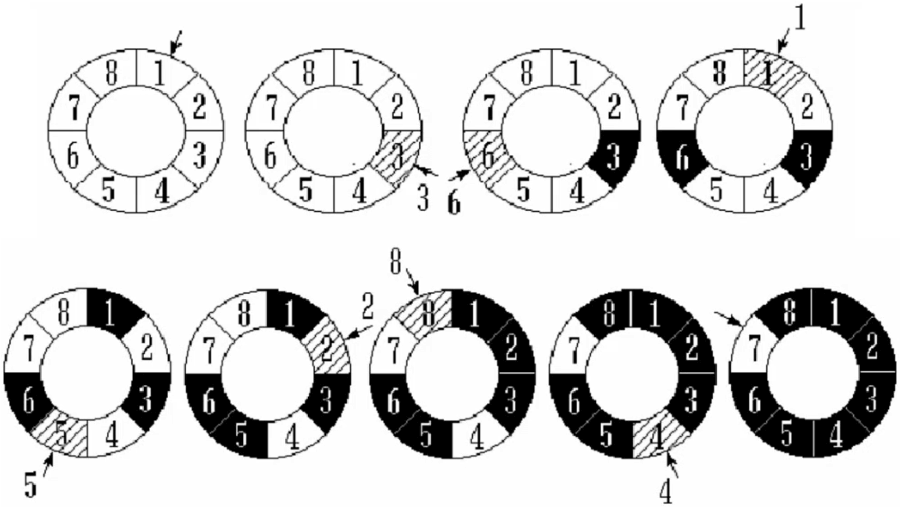

为了发挥循环链表的最大威力，增设1个成员变量、3个方法：
1. `current`：用于指向某个节点；
2. `void reset()`：让 `current` 指向头结点 `first`；
3. `E next()`：让 `current` 往后走一步，也就是 `current = current.next`;
4. `E remove()`：删除 `current` 指向的节点，删除成功后让 `current` 指向下一个节点；
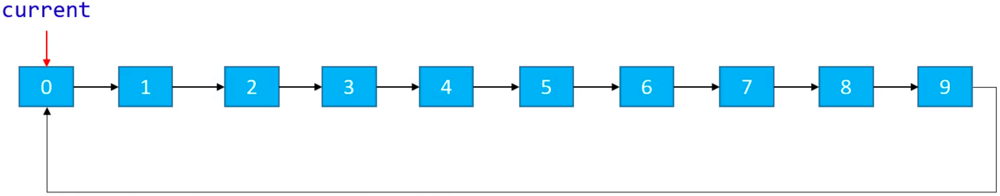

相关代码：
```
public void reset() {
    current = first;
}

public E next() {
    if (current == null) return null;
    
    current = current.next;
    return current.element;
}

public E remove() {
    if (current == null) return null;
    
    E element = remove(current);
    if (size == 0) {
        current = null;
    } else {
        current = current.next;
    }
    
    return element;
}

public E remove(int index) {
    rangeCheck(index);
    return remove(node(index));
}

public E remove(Node<E> node) {
    if (size == 0) {
        first = null;
        last = null;
    } else {
        Node<E> prev = node.prev;
        Node<E> next = node.next;
        prev.next = next;
        next.prev = prev;
        
        if (node == first) { // index == 0
            first = next;
        }
        
        if (node == last) { // index == size - 1
            last = prev;
        }
    }
    size--;
    return node.element;
}
```

测试：
```
static void josephus() {
    CircleLinkedList<Integer> list = new CircleLinkedList<>();
    for (int i = 1; i <= 8; i++) {
        list.add(i);
    }
    
    // 指向头结点（指向1）
    list.reset();
    
    while (!list.isEmpty()) {
        list.next();
        list.next();
        System.out.println(list.remove());
    }
}
```

打印结果：
```
3
6
1
5
2
8
4
7
```

# 静态链表
单向链表、双向链表、单向循环链表和双向循环链表，都是依赖于指针实现的。在早期的编程语言中，有些是没有指针的，比如 BASIC、FORTRAN 语言。它们通过数组来模拟链表，成为静态链表。

在一个数组中，每个元素存放两个数据，一个是数值，一个是下一个元素的索引。比如第一个元素是的值是 11，下一个元素是索引为 3 的元素（44）：
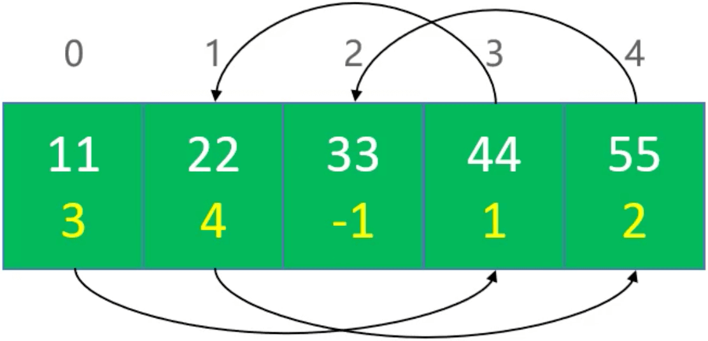
相当于下面这个链表：


* 思考：如果数组的每个元素只能存放1个数据呢？  
  使用2个数组，一个数组存放索引关系，另一个数组存放值。

# 动态数组优化
定义变量 `int first`，标记首元素的索引。如获取 index 的元素可以通过 `first + index % elements.length` 对应元素的坐标。

## remove
### 删除首元素 
当前数组 `first == 0`：
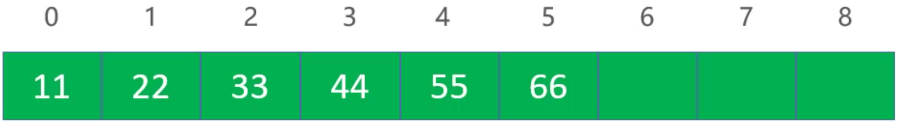
删除首元素，让 `first = 1`：
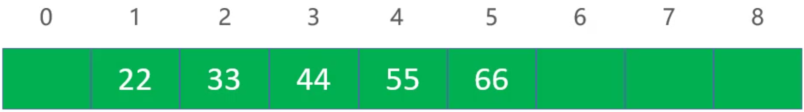
删除首元素，让 `first = 2`：
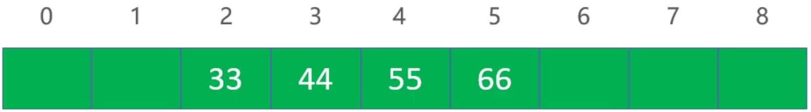
### 删除中间元素
当前数组 `first == 0`：
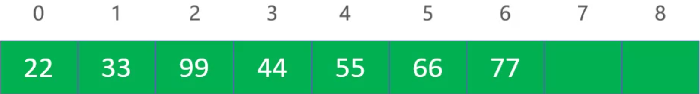
删除1处的元素，让0处的元素向后移动一位，覆盖掉1处的元素，并将0处的元素清空，最后让 `first = 1`：
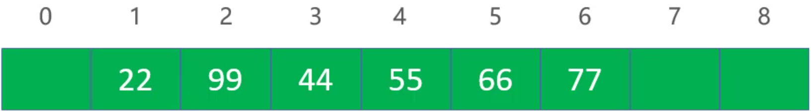
代码实现：
```
public E remove(int index) {
    
	rangeCheck(index);
	
	int oldIndex = (first + index) % elements.length;
	E old = elements[oldIndex];
	
	if (index * 2 >= size) {
		for (int i = index + 1; i < size; i++) {
			int newIndex = (first + i) % elements.length;
			int nextIndex = (first + i - 1) % elements.length;
			elements[nextIndex] = elements[newIndex];
		}
		int last = (first + size - 1) % elements.length;
		elements[last] = null;
	} else {
		for (int i = index; i > 0; i--) {
			int newIndex = (first + i) % elements.length;
			int nextIndex = (first + i - 1) % elements.length;
			elements[newIndex] = elements[nextIndex];
		}
		elements[first] = null;
		first = (first + 1) < elements.length ? first + 1 : 0;
	}
	size--;
	trim();
	return old;
}
```

## add
### 在末尾添加
当前数组 `first == 2`：

在数组末尾添加，此时不需要修改 first， `first = 2`：
### 在头部添加
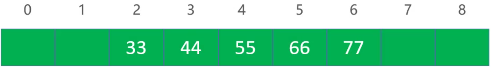
在数组的头部添加元素，让 `first = 1`：
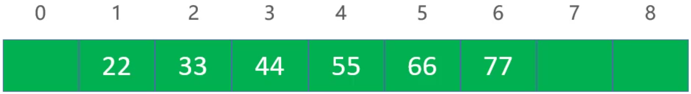
在数组的头部添加元素，让 `first = 0`：
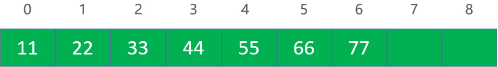
在数组的头部添加元素，让 `first = 8`：
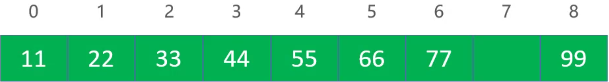
### 在中间添加
当前数组 `first == 1`：

在 3 处插入99，只需要让1、2处的元素往前移动一位，让 `first = 0`：

代买实现：
```
public void add(int index, E element) {
    
	rangeCheckForAdd(index);
	
	ensureCapacity(size + 1);
	
	if (index * 2 >= size) {
		for (int i = size; i > index; i--) {
			int newIndex = (first + i) % elements.length;
			int nextIndex = (first + i - 1) % elements.length;
			elements[newIndex] = elements[nextIndex];
		}
		index = (first + index) % elements.length;
		elements[index] = element;
	} else {
		first = (first - 1) >= 0 ? first - 1 : elements.length - 1;
		for (int i = 0; i < index; i++) {
			int newIndex = (first + i) % elements.length;
			int nextIndex = (first + i + 1) % elements.length;
			elements[newIndex] = elements[nextIndex];
		}
		index = (first + index) % elements.length;
		elements[index] = element;
	}
	System.out.println(first);
	size++;
}
```
## set&get
通过 `first + index % elements.length` 对应元素的坐标，然后获取元素：
```
public E get(int index) { //O(1)
	rangeCheck(index);
	index = (first + index) % elements.length;
	return elements[index];
}

public E set(int index, E element) { //O(1)
	rangeCheck(index);
	index = (first + index) % elements.length;
	E old = elements[index];
	elements[index] = element;
	return old;
}
```

## 扩容
当数组装满后，新创建一个容量扩大1.5倍的数组，将原数组里的元素移动到新数组里，从0开始填充，`first = 0`。
```
private void ensureCapacity(int capacity) {
	int oldCapacity = elements.length;
	if (oldCapacity >= capacity) return;
	// 新容量为就容量的1.5倍
	int newCapacity = oldCapacity + (oldCapacity >> 1); //iOS 1.6, java 1.5, >> 表示除以2
	E[] newElements = (E[]) new Object[newCapacity];
	for (int i = 0; i < size; i++) {
		int index = (first + i) % elements.length;
		newElements[i] = elements[index];
	}
	elements = newElements;
	first = 0;
	
	System.out.println(oldCapacity + "扩容为" + newCapacity);
}
```

## 缩容
当数组满足缩容条件时，新创建一个容量按规则缩小的数组，将原数组里的元素移动到新数组里，从0开始填充，`first = 0`。
```
private void trim() {
	int oldCapacity = elements.length;
	int newCapacity = oldCapacity >> 1;
	// 剩余空间小于一半 || 空间大小 <= 默认空间
	if (size >= newCapacity || oldCapacity <= DEFAULT_CAPACITY) return;
	
	E[] newElements = (E[]) new Object[newCapacity];
	for (int i = 0; i < size; i++) {
		int newIndex = (first + i) % elements.length;
		newElements[i] = elements[newIndex];
	}
	elements = newElements;
	first = 0;
	
	System.out.println(oldCapacity + "缩容为" + newCapacity);
}
```

## 后期优化
```
private int ensureIndex(int index) {
	return (first + index) % elements.length;
}

private void rightMoveFitst() {
	first = (first + 1) < elements.length ? first + 1 : 0;
}

private void leftMoveFitst() {
	first = (first - 1) >= 0 ? first - 1 : elements.length - 1;
}
```
