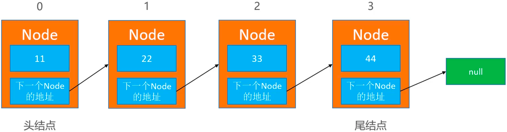
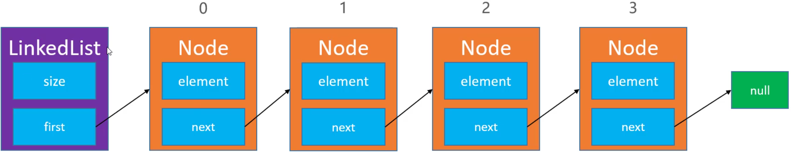
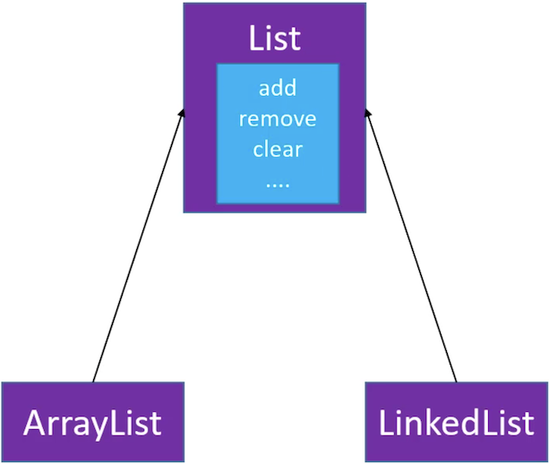
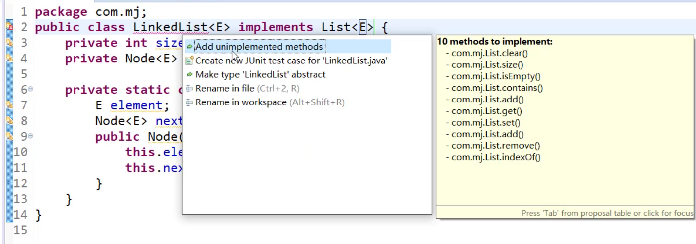
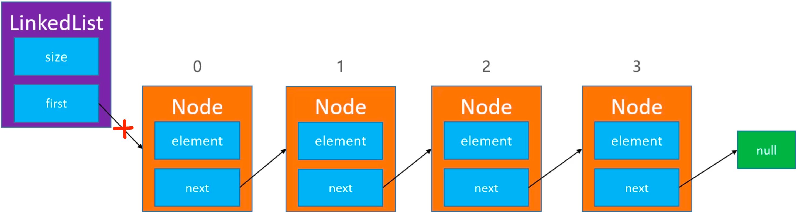
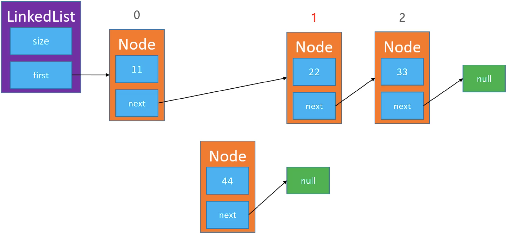
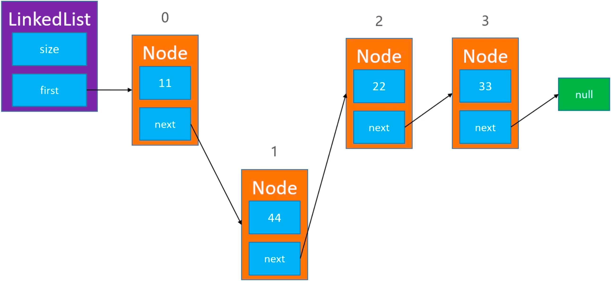
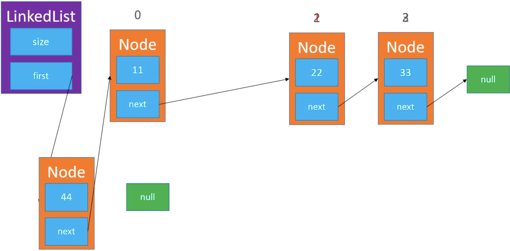
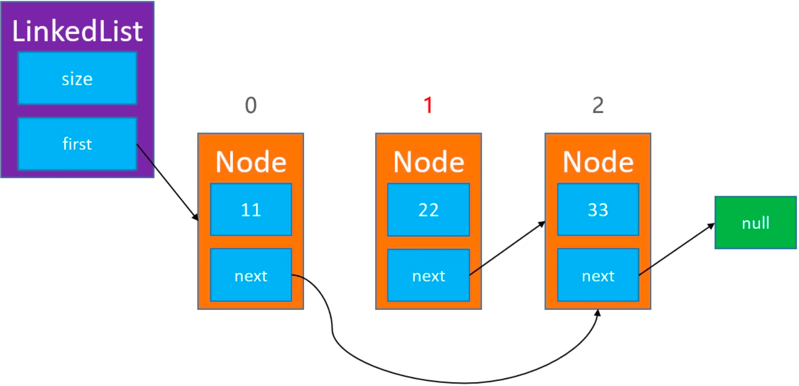
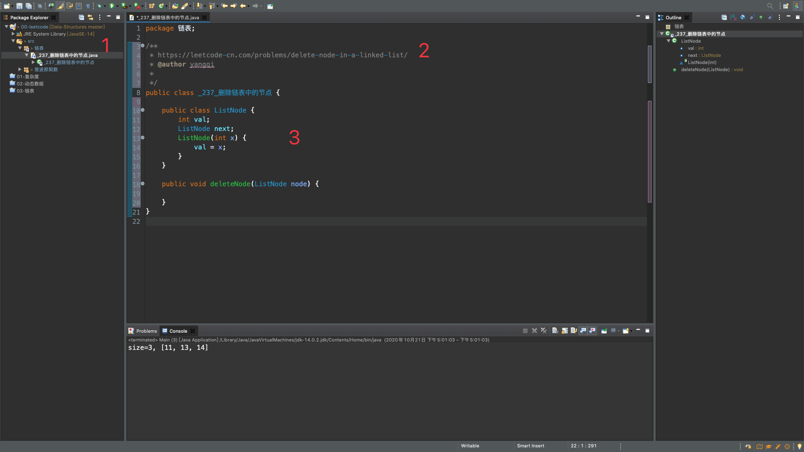

[链表](https://baike.baidu.com/item/%E9%93%BE%E8%A1%A8/9794473?fr=aladdin)是一种物理存储单元上非连续、非顺序的存储结构，数据元素的逻辑顺序是通过链表中的指针链接次序实现的。

<!-- more -->

# 链表
动态数组在扩容时，如果新扩出来的空间没有使用到，就造成了内存空间的大量浪费。而链表则是用到多少就申请多少内存空间。

线性表的链式存储表示的特点是用一组任意的存储单元存储线性表的数据元素。这组存储单元可以是连续的，也可以是不连续的。

链表由一系列结点（链表中每一个元素称为结点）组成，结点可以在运行时动态生成。每个结点包括两个部分：一个是存储数据元素的数据域，另一个是存储下一个结点地址的指针域。


# 自定义链表
## 链表的设计
定义 size 记录链表的大小，定义 firt 指向第一个节点（头结点）。每个节点里定义 element 存储数据，定义 next 指向下一个节点（存储下一个结点地址）。


## 接口设计

创建一个接口类 List，用来定义 ArrayList 和 LinkedList 的公共接口（右键 -> new -> Interface）：
```
public interface List<E> {
    /**
     * 错误码
     */
    public static final int ELEMENT_NOT_FOUND = -1;
    /**
     * 清除所有元素
     */
    public void clear();
    /**
     * 元素的数量
     * @return
     */
    public int size();
    /**
     * 是否为空
     * @return
     */
    public boolean isEmpty();
    /**
     * 是否包含某个元素
     * @param element
     * @return
     */
    public boolean contains(E element);
    /**
     * 添加元素到尾部
     * @param element
     */
    public void add(E element); 
    /**
     * 获取index位置的元素
     * @param index
     * @return
     */
    public E get(int index);
    /**
     * 设置index位置的元素
     * @param index
     * @param element
     * @return 原来的元素ֵ
     */
    public E set(int index, E element);
    /**
     * 在index位置插入一个元素
     * @param index
     * @param element
     */
    public void add(int index, E element);
    /**
     * 删除index位置的元素
     * @param index
     * @return
     */
    public E remove(int index);
    /**
     * 查看元素的索引
     * @param element
     * @return
     */
    public int indexOf(E element);
}
```

创建一个抽象类 AbstractList，实现 ArrayList 和 LinkedList 有相同实现的方法：
```
// implements 实现接口
// abstract 抽象类：1、可以选择实现接口；2、抽象类无法被创建（new AbstractList<>()）
public abstract class AbstractList<E> implements List<E>{
    
    protected int size; // protected 子类可以访问
    
    @Override
    public int size() {
        return size;
    }

    @Override
    public boolean isEmpty() {
        return size == 0;
    }

    @Override
    public boolean contains(E element) {
        return indexOf(element) != ELEMENT_NOT_FOUND;
    }

    @Override
    public void add(E element) {
        add(size, element);
    }
    
    protected void outOfBounds(int index) {
        throw new IndexOutOfBoundsException("Index:" + index + ", Size" + size);
    }
    
    protected void rangeCheck(int index) {
        if (index < 0 || index >= size) {
            outOfBounds(index);
        }
    }
    
    protected void rangeCheckForAdd(int index) {
        if (index < 0 || index > size) {
            outOfBounds(index);
        }
    }
}
```

让 ArrayList 和 LinkedList 继承自 AbstractList：
```
// 动态数组
public class ArrayList<E> extends AbstractList<E> { 
    // 实现剩余方法
}

// 链表
public class LinkedList<E> extends AbstractList<E> {
    // 实现剩余方法
}
```

ps：  
实现 List 接口的快捷方式：


## clear

```
public void clear() {
    size = 0;
    first = null;
}
```

## get/set
定义 `node(int index)` 方法，查找指定 index 处的 node 并返回：
```
public E get(int index) {
    return node(index).element;
}

public E set(int index, E element) {
    Node<E> node = node(index);
    E old = node.element;
    node.element = element;
    return old;
}

private Node<E> node(int index) {
    rangeCheck(index);
    
    Node<E> node = first;
    for (int i = 0; i < index; i++) {
        node = node.next;
    }
    return node;
}
```

## add
添加新的 newNode：


### index == 1
要添加一个 node 到 index == 1 的位置，只需要找到 index - 1 处的 prev，那么 index == 1 处就是 prev.next。让新添加的 newNode 的 next 指向 prev.next，再让 prev 的 next 指针指向 newNode：


### index == size
要添加一个 node 到 index == size 的位置，只需要找到 index - 1 处的 prev，那么 index == size 处就是 prev.next（null）。让新添加的 newNode 的 next 指向 prev.next，再让 prev 的 next 指针指向 newNode：


### index == 0
要添加一个 node 到 index == 0 的位置，只需要让新添加的 newNode 的 next 指向 first，再让 first 指向 newNode：


### 代码实现
```
public void add(int index, E element) {
    if (index == 0) {
        first = new Node<>(element, first);
    } else {
        Node<E> prev = node(index - 1);
        prev.next = new Node<>(element, prev.next); 
    }
    size++;
}
```

## remove
要删除 index == 1 处的 node，只需要找到 index - 1 出的 prev，让 `prev.next = prev.next.next`。

要删除 index == 0 处的 node，只需要让 `first = first.next`。


```
public E remove(int index) {
    rangeCheck(index);
    
    Node<E> node = first;
    if (index == 0) {
        first = first.next;
    } else {
        Node<E> prev = node(index - 1);
        node = prev.next;
        prev.next = node.next;  
    }
    size--;
    return node.element;
}
```

## indexOf
```
public int indexOf(E element) {
    if (element == null) {
        Node<E> node = first;
        for (int i = 0; i < size; i++) {
            if (node.element == null) return i;
            
            node = node.next;
        }
    } else {
        Node<E> node = first;
        for (int i = 0; i < size; i++) {
            if (node.element.equals(element)) return i;
            
            node = node.next;
        }   
    }
    return ELEMENT_NOT_FOUND;
}
```

ps：[VisuAlgo](https://visualgo.net/zh) 以动画的方式展示了数据结构基本操作的原理，还有代码实现。

## 练习 - 删除链表中的节点
基本操作：  
1. 以题目的类型和题目名称分别创建“链表”包和“_237_删除链表中的节点”文件；
2. 保存改题目的连接，方便以后查看；
3. 拷贝网页中的条件及题目；



