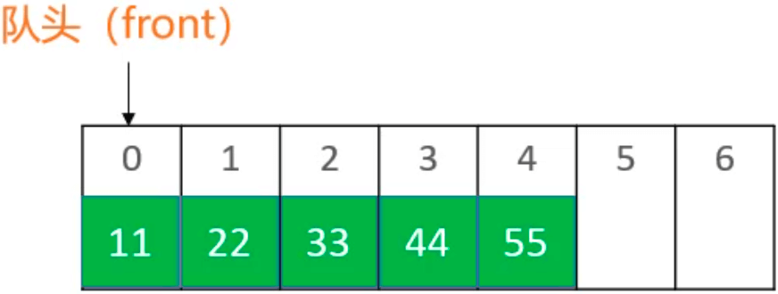
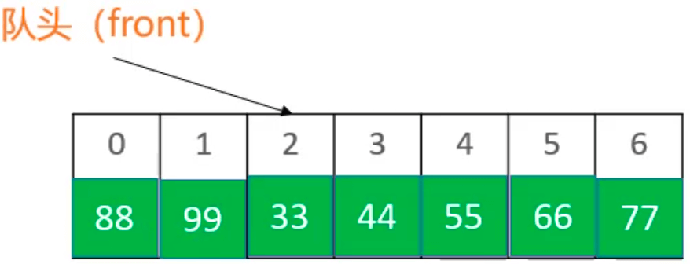
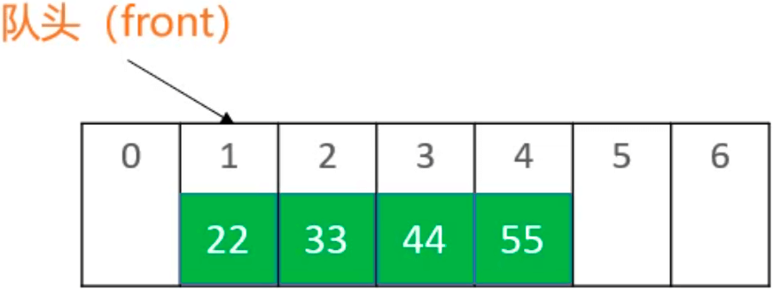

[队列](https://baike.baidu.com/item/%E9%98%9F%E5%88%97/14580481?fr=aladdin)是一种特殊的线性表，特殊之处在于它只允许在表的前端（front）进行删除操作，而在表的后端（rear）进行插入操作，和栈一样，队列是一种操作受限制的线性表。进行插入操作的端称为队尾，进行删除操作的端称为队头。

<!-- more -->

# 队列

队列是一种特殊的线性表，只能在头尾两端进行操作：  
队尾（rear）：只能从队尾添加元素，一般叫做 enQueue，入队；  
队头（front）：只能从队头移除元素，一般叫做 deQueue，出队；  
先进先出的原则，First In First Out，FIFO  

入队：

出队：


## 通过双向链表实现
动态数组和链表都可以用来实现队列。因为队列主要是在头尾操作元素，所以优先使用双向链表实现队列。
```
public class Queue<E> {
	LinkedList<E> list = new LinkedList<>();
	
	public int size() {
		return list.size();
	}

	public boolean isEmpty() {
		return list.isEmpty();
	}
	
	public void clear() {
		list.clear();
	}

	public void enQueue(E element) {
		list.add(element);
	}

	public E deQueue() {
		return list.remove(0);
	}

	public E front() {
		return list.get(0);
	}
}
```

测试：
```
public static void main(String[] args) {
	Queue<Integer> queue = new Queue<>();
	queue.enQueue(11);
	queue.enQueue(22);
	queue.enQueue(33);
	queue.enQueue(44);
	
	while (!queue.isEmpty()) {
		System.out.println(queue.deQueue());
	}
}
```

打印结果：
```
11
22
33
44
```

## 通过栈实现
[232. 用栈实现队列](https://leetcode-cn.com/problems/implement-queue-using-stacks/submissions/)
入队：

出队：

```
Stack<Integer> inStack;
Stack<Integer> outStack;

public _232_用栈实现队列() {
	inStack = new Stack<>();
	outStack = new Stack<>();
}

/** 入栈 */
public void push(int x) {
	inStack.push(x);
}

/** 出栈 */
public int pop() {
	checkOutStack();
	return outStack.pop();
}

/** 首元素 */
public int peek() {
	checkOutStack();
	return outStack.peek();
}

/** 判空 */
public boolean empty() {
	return inStack.isEmpty() && outStack.isEmpty();
}

private void checkOutStack() {
	if (outStack.isEmpty()) {
		while (!inStack.isEmpty()) {
			outStack.push(inStack.pop());
		}
	}
}
```

## 源码分析
Queue.class 文件里只有定义没有实现：
```
public interface Queue<E> extends Collection<E> {
    boolean add(E e);
    
    // 入队
    boolean offer(E e);
    
    E remove();
    
    // 出队
    E poll();

    E element();
    
    // 首元素
    E peek();
}
```

在 Queue.class 文件里的注释可以看到，Queue 是在 LinkedList.class 里实现的：
```
/**
 * Retrieves, but does not remove, the head (first element) of this list.
 *
 * @return the head of this list, or {@code null} if this list is empty
 * @since 1.5
 */
public E peek() {
    final Node<E> f = first;
    return (f == null) ? null : f.item;
}

/**
 * Retrieves, but does not remove, the head (first element) of this list.
 *
 * @return the head of this list
 * @throws NoSuchElementException if this list is empty
 * @since 1.5
 */
public E element() {
    return getFirst();
}

/**
 * Retrieves and removes the head (first element) of this list.
 *
 * @return the head of this list, or {@code null} if this list is empty
 * @since 1.5
 */
public E poll() {
    final Node<E> f = first;
    return (f == null) ? null : unlinkFirst(f);
}

/**
 * Retrieves and removes the head (first element) of this list.
 *
 * @return the head of this list
 * @throws NoSuchElementException if this list is empty
 * @since 1.5
 */
public E remove() {
    return removeFirst();
}

/**
 * Adds the specified element as the tail (last element) of this list.
 *
 * @param e the element to add
 * @return {@code true} (as specified by {@link Queue#offer})
 * @since 1.5
 */
public boolean offer(E e) {
    return add(e);
}
```

# 双端队列
[双端队列](https://baike.baidu.com/item/deque/849385?fromtitle=%E5%8F%8C%E7%AB%AF%E9%98%9F%E5%88%97&fromid=2968804&fr=aladdin)是能在头尾两端进行添加、删除操作的队列。
```
public class Deque<E> {
	
	LinkedList<E> list = new LinkedList<>();
	
	public int size() {
		return list.size();
	}

	public boolean isEmpty() {
		return list.isEmpty();
	}
	
	public void clear() {
		list.clear();
	}

	public void enQueueRear(E element) {
		list.add(element);
	}

	public E deQueueFront() {
		return list.remove(0);
	}

	public void enQueueFront(E element) {
		list.add(0, element);
	}

	public E deQueueRear() {
		return list.remove(list.size()-1);
	}

	public E front() {
		return list.get(0);
	}

	public E rear() {
		return list.get(list.size()-1);
	}
}
```

测试：
```
static void test1() {
	Deque<Integer> queue = new Deque<>();
	queue.enQueueFront(11);
	queue.enQueueFront(22);
	queue.enQueueRear(33);
	queue.enQueueRear(44);
	
	while (!queue.isEmpty()) {
		System.out.println(queue.deQueueFront());
	}
}

public static void main(String[] args) {
	test1();
}
```

打印结果：
```
22
11
33
44
```

## 源码分析
同 Queue 的源码分析👆。

# 循环队列
[循环队列](https://baike.baidu.com/item/%E5%BE%AA%E7%8E%AF%E9%98%9F%E5%88%97/3685773?fr=aladdin)底层使用数组实现的，实现思路可以参考[链表](http://kevinyanggit.github.io/2020/10/20/%E6%95%B0%E6%8D%AE%E7%BB%93%E6%9E%84%E4%B8%8E%E7%AE%97%E6%B3%95/%E9%93%BE%E8%A1%A8/)中的动态数组优化。

对于一个队列：

队头的两个元素依次出栈，`front` 指向 `2`：

队尾依次入栈66、77、88、99，其中88、99超出数组大小，放到数组的 `0` 和 `1` 处（`(front + index) % elements.length`）：


ps：`%` 运算符的优化 - 已知 n>=0，m>=0，n < 2m，则 n%m 等价于 `n - (m > n ? 0 : m)`。

代码实现：
```
public class CircleQueue<E> {
	/*
	 * 首元素
	 */
	private int front;
	/*
	 * 数据大小
	 */
	private int size;
	/*
	 * 容器
	 */
	private E[] elements;
	/*
	 * 默认容量
	 */
	private static final int DEFAULT_CAPICATY = 10;
	
	public CircleQueue() {
		elements = (E[]) new Object[DEFAULT_CAPICATY];
	}
	
	public int size() {
		return size;
	}

	public boolean isEmpty() {
		return size == 0;
	}
	
	public void clear() {
		for (int i = 0; i < elements.length; i++) {
			elements[Index(i)] = null;
		}
		size = 0;
		front = 0;
	}

	public void enQueue(E element) {
		ensureCapicity(size + 1);
		elements[Index(size)] = element;
		size++;
	}

	public E deQueue() {
		E element = elements[front];
		elements[front] = null;
		front = Index(1);
		size--;
		return element;
	}

	public E front() {
		return elements[front];
	}
	
	/*
	 * 已知 n>=0，m>=0，n < 2m，则 n%m 等价于
	 * n - (m > n ? 0 : m)
	 */
	private int Index(int index) {
		index += front;
		return index - (elements.length > index ? 0 : elements.length);
	}
	
	private void ensureCapicity(int capicaty) {
		int oldCapicaty = elements.length;
		if (oldCapicaty >= capicaty) return;
		int newCapicaty = oldCapicaty + (oldCapicaty >> 1);
		E[] newElements = (E[]) new Object[newCapicaty];
		for (int i = 0; i < elements.length; i++) {
			newElements[i] = elements[Index(i)];
		}
		elements = newElements;
		front = 0;
	}
	
	public String toString() {
		StringBuilder string = new StringBuilder();
		string.append("capicaty=").append(elements.length)
		.append(" size=").append(size)
		.append(" front=").append(front)
		.append(", [");
		for (int i = 0; i < elements.length; i++) {
			if (i != 0) {
				string.append(", ");
			}
			string.append(elements[i]);
		}
		string.append("]");
		return string.toString();
	}
}
```

测试：
```
static void test2() {
	CircleQueue<Integer> queue = new CircleQueue<>();
	// capicaty=10 size=10 front=0, [0, 1, 2, 3, 4, 5, 6, 7, 8, 9]
	for (int i = 0; i < 10; i++) {
		queue.enQueue(i);
	}
	// capicaty=10 size=5 front=5, [null, null, null, null, null, 5, 6, 7, 8, 9]
	for (int i = 0; i < 5; i++) {
		queue.deQueue();
	}
	// capicaty=10 size=10 front=5, [10, 11, 12, 13, 14, 5, 6, 7, 8, 9]
	for (int i = 0; i < 5; i++) {
		queue.enQueue(i+10);
	}
	// capicaty=22 size=20 front=0, [5, 6, 7, 8, 9, 10, 11, 12, 13, 14, 0, 1, 2, 3, 4, 5, 6, 7, 8, 9, null, null]
	for (int i = 0; i < 10; i++) {
		queue.enQueue(i);
	}
	System.out.println(queue);
	while (!queue.isEmpty()) {
		System.out.println(queue.deQueue());
	}
}
```

# 循环双端队列
[循环双端队列]()可以进行两端添加、删除操作的循环队列，实现思路可以循环队列和[链表](http://kevinyanggit.github.io/2020/10/20/%E6%95%B0%E6%8D%AE%E7%BB%93%E6%9E%84%E4%B8%8E%E7%AE%97%E6%B3%95/%E9%93%BE%E8%A1%A8/)中的动态数组优化。

对于一个队列：

队头入栈22，因为 `front` 指向的位置是队列 `0` 的位置，在 `front` 的左边入栈，也就相当于在队列 `-1` 的位置入栈(`(front - 1) % elements.length`)：


代码实现：
```
public class CircleDeque<E> {
	private int front;
	private int size;
	private E[] elements;
	private static final int DEFAULT_CAPICITY = 10;
	
	public CircleDeque() {
		elements = (E[]) new Object[DEFAULT_CAPICITY];
	}
	
	public int size() {
		return size;
	}

	public boolean isEmpty() {
		return size == 0;
	}
	
	public void clear() {
		for (int i = 0; i < size; i++) {
			elements[Index(i)] = null;
		}
		size = 0;
		front = 0;
	}

	public void enQueueRear(E element) {
		ensureCapicity(size+1);
		elements[Index(size)] = element;
		size++;
	}

	public E deQueueFront() {
		E element = elements[front];
		elements[front] = null;
		front = Index(1);
		size--;
		return element;
	}

	public void enQueueFront(E element) {
		ensureCapicity(size+1);
		front = Index(-1);
		elements[front] = element;
		size++;
	}

	public E deQueueRear() {
		E element = elements[Index(size - 1)];
		elements[Index(size - 1)] = null;
		size--;
		return element;
	}

	public E front() {
		return elements[front];
	}

	public E rear() {
		return elements[Index(size - 1)];
	}
	
	private int Index(int index) {
		index += front;
		if (index < 0) {
			return index + elements.length;
		}
		return index - (elements.length > index ? 0 : elements.length);
	}
	
	private void ensureCapicity(int capicity) {
		int oldCapicity = elements.length;
		if (oldCapicity >= capicity) return;
		oldCapicity = oldCapicity + (oldCapicity >> 1);
		E[] newElements = (E[]) new Object[oldCapicity];
		for (int i = 0; i < elements.length; i++) {
			newElements[i] = elements[Index(i)];
		}
		elements = newElements;
		front = 0;
	}
	
	@Override
	public String toString() {
		StringBuilder string = new StringBuilder();
		string.append("capicity=").append(elements.length)
		.append(" size=").append(size)
		.append(" front=").append(front)
		.append(", [");
		for (int i = 0; i < elements.length; i++) {
			if (i != 0) {
				string.append(", ");
			}
			string.append(elements[i]);
		}
		string.append("]");
		return string.toString();
	}
}
```

测试：
```
static void test3() {
	CircleDeque<Integer> queue = new CircleDeque<>();
	// capicity=22 size=20 front=20, [8, 7, 6, 5, 4, 3, 2, 1, 100, 101, 102, 103, 104, 105, 106, 107, 108, 109, null, null, 10, 9]
	for (int i = 0; i < 10; i++) {
		queue.enQueueFront(i + 1);
		queue.enQueueRear(i + 100);
	}
	// capicity=22 size=14 front=1, [null, 7, 6, 5, 4, 3, 2, 1, 100, 101, 102, 103, 104, 105, 106, null, null, null, null, null, null, null]
	for (int i = 0; i < 3; i++) {
		queue.deQueueFront();
		queue.deQueueRear();
	}
	
	// capicity=22 size=16 front=0, [11, 7, 6, 5, 4, 3, 2, 1, 100, 101, 102, 103, 104, 105, 106, 12, null, null, null, null, null, null]
	queue.enQueueFront(11);
	queue.enQueueRear(12);
	
	System.out.println(queue);
	while (!queue.isEmpty()) {
		System.out.println(queue.deQueueFront());
	}
}
```

# 练习
[225. 用队列实现栈](https://leetcode-cn.com/problems/implement-stack-using-queues/)

```
public class _225_用队列实现栈 {

    Queue<Integer> queue1;
    Queue<Integer> queue2;
    
    public _225_用队列实现栈() {
        queue1 = new LinkedList<>();
        queue2 = new LinkedList<>();
    }
    
    /** 元素 x 入栈 */
    public void push(int x) {
        queue2.add(x);
        while (!queue1.isEmpty()) {
            queue2.offer(queue1.poll());
        }
        Queue<Integer> temp = queue1;
        queue1 = queue2;
        queue2 = temp;
    }
    
    /** 移除栈顶元素 */
    public int pop() {
        return queue1.poll();
    }
    
    /** 获取栈顶元素 */
    public int top() {
        return queue1.peek();
    }
    
    /** 返回栈是否为空 */
    public boolean empty() {
        return queue1.isEmpty();
    }
}
```

.
