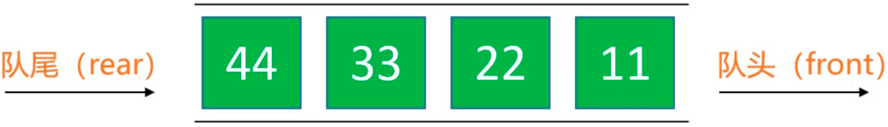
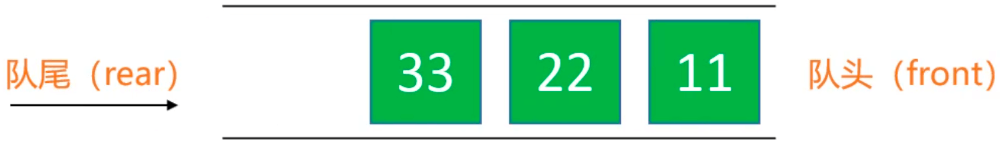
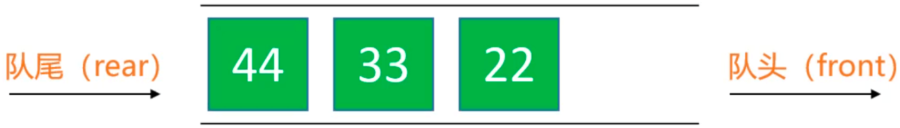
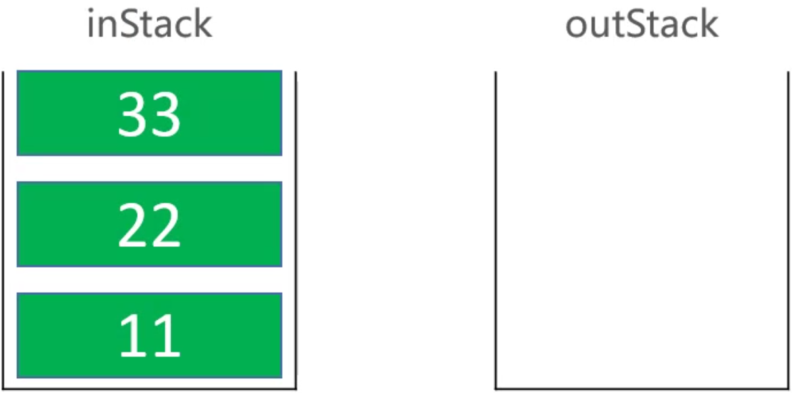
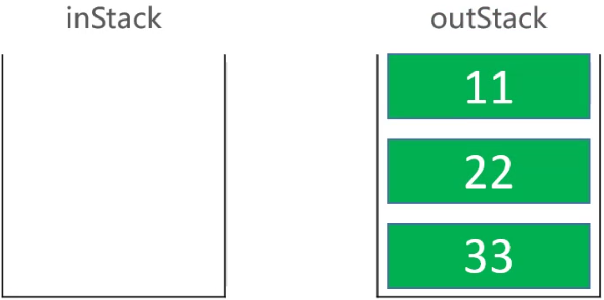

[队列](https://baike.baidu.com/item/%E9%98%9F%E5%88%97/14580481?fr=aladdin)是一种特殊的线性表，特殊之处在于它只允许在表的前端（front）进行删除操作，而在表的后端（rear）进行插入操作，和栈一样，队列是一种操作受限制的线性表。进行插入操作的端称为队尾，进行删除操作的端称为队头。

<!-- more -->

# 队列

队列是一种特殊的线性表，只能在头尾两端进行操作：  
队尾（rear）：只能从队尾添加元素，一般叫做 enQueue，入队；  
队头（front）：只能从队头移除元素，一般叫做 deQueue，出队；  
先进先出的原则，First In First Out，FIFO  

入队：

出队：


## 通过双向链表实现
动态数组和链表都可以用来实现队列。因为队列主要是在头尾操作元素，所以优先使用双向链表实现队列。
```
public class Queue<E> {
	LinkedList<E> list = new LinkedList<>();
	
	public int size() {
		return list.size();
	}

	public boolean isEmpty() {
		return list.isEmpty();
	}
	
	public void clear() {
		list.clear();
	}

	public void enQueue(E element) {
		list.add(element);
	}

	public E deQueue() {
		return list.remove(0);
	}

	public E front() {
		return list.get(0);
	}
}
```

测试：
```
public static void main(String[] args) {
	Queue<Integer> queue = new Queue<>();
	queue.enQueue(11);
	queue.enQueue(22);
	queue.enQueue(33);
	queue.enQueue(44);
	
	while (!queue.isEmpty()) {
		System.out.println(queue.deQueue());
	}
}
```

打印结果：
```
11
22
33
44
```

## 通过栈实现
[232. 用栈实现队列](https://leetcode-cn.com/problems/implement-queue-using-stacks/submissions/)
入队：

出队：

```
Stack<Integer> inStack;
Stack<Integer> outStack;

public _232_用栈实现队列() {
	inStack = new Stack<>();
	outStack = new Stack<>();
}

/** 入栈 */
public void push(int x) {
	inStack.push(x);
}

/** 出栈 */
public int pop() {
	checkOutStack();
	return outStack.pop();
}

/** 首元素 */
public int peek() {
	checkOutStack();
	return outStack.peek();
}

/** 判空 */
public boolean empty() {
	return inStack.isEmpty() && outStack.isEmpty();
}

private void checkOutStack() {
	if (outStack.isEmpty()) {
		while (!inStack.isEmpty()) {
			outStack.push(inStack.pop());
		}
	}
}
```

## 源码分析
Queue.class 文件里只有定义没有实现：
```
public interface Queue<E> extends Collection<E> {
    boolean add(E e);
    
    // 入队
    boolean offer(E e);
    
    E remove();
    
    // 出队
    E poll();

    E element();
    
    // 首元素
    E peek();
}
```

在 Queue.class 文件里的注释可以看到，Queue 是在 LinkedList.class 里实现的：
```
/**
 * Retrieves, but does not remove, the head (first element) of this list.
 *
 * @return the head of this list, or {@code null} if this list is empty
 * @since 1.5
 */
public E peek() {
    final Node<E> f = first;
    return (f == null) ? null : f.item;
}

/**
 * Retrieves, but does not remove, the head (first element) of this list.
 *
 * @return the head of this list
 * @throws NoSuchElementException if this list is empty
 * @since 1.5
 */
public E element() {
    return getFirst();
}

/**
 * Retrieves and removes the head (first element) of this list.
 *
 * @return the head of this list, or {@code null} if this list is empty
 * @since 1.5
 */
public E poll() {
    final Node<E> f = first;
    return (f == null) ? null : unlinkFirst(f);
}

/**
 * Retrieves and removes the head (first element) of this list.
 *
 * @return the head of this list
 * @throws NoSuchElementException if this list is empty
 * @since 1.5
 */
public E remove() {
    return removeFirst();
}

/**
 * Adds the specified element as the tail (last element) of this list.
 *
 * @param e the element to add
 * @return {@code true} (as specified by {@link Queue#offer})
 * @since 1.5
 */
public boolean offer(E e) {
    return add(e);
}
```

# 双端队列
[双端队列](https://baike.baidu.com/item/deque/849385?fromtitle=%E5%8F%8C%E7%AB%AF%E9%98%9F%E5%88%97&fromid=2968804&fr=aladdin)是能在头尾两端进行添加、删除操作的队列。
```
public class Deque<E> {
	
	LinkedList<E> list = new LinkedList<>();
	
	public int size() {
		return list.size();
	}

	public boolean isEmpty() {
		return list.isEmpty();
	}
	
	public void clear() {
		list.clear();
	}

	public void enQueueRear(E element) {
		list.add(element);
	}

	public E deQueueFront() {
		return list.remove(0);
	}

	public void enQueueFront(E element) {
		list.add(0, element);
	}

	public E deQueueRear() {
		return list.remove(list.size()-1);
	}

	public E front() {
		return list.get(0);
	}

	public E rear() {
		return list.get(list.size()-1);
	}
}
```

测试：
```
static void test1() {
	Deque<Integer> queue = new Deque<>();
	queue.enQueueFront(11);
	queue.enQueueFront(22);
	queue.enQueueRear(33);
	queue.enQueueRear(44);
	
	while (!queue.isEmpty()) {
		System.out.println(queue.deQueueFront());
	}
}

public static void main(String[] args) {
	test1();
}
```

打印结果：
```
22
11
33
44
```

## 源码分析
同 Queue 的源码分析👆。

# 循环队列
参考[动态数组优化](http://kevinyanggit.github.io/2020/10/20/%E6%95%B0%E6%8D%AE%E7%BB%93%E6%9E%84%E4%B8%8E%E7%AE%97%E6%B3%95/%E9%93%BE%E8%A1%A8/)

